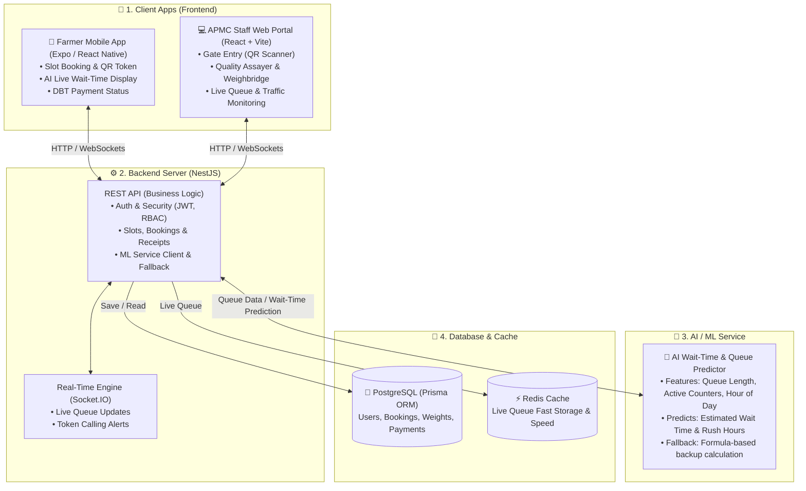

# 🌾 Agricultural Procurement & Queue Management Platform
## System Architecture, Process Flow & Tech Stack Overview (with AI/ML)

---

## 1. Simplified System Architecture Diagram (with AI/ML Layer)



### 🧠 Project Me AI / ML Ka Kaam (Feature Details):
1. **Dynamic Wait-Time Prediction**:
   - Mandi me bheed aur counters ke hisab se AI model calculate karta hai ki kisaan ko kitni der intezar karna padega.
   - **Inputs (Features)**: `queueLength` (line me kitne hain), `activeCounters` (kitne counter chalu hain), `arrivalsLast30Minutes` (aane ki speed), `hourOfDay` & `dayOfWeek` (rush hours).
   - **Output**: `estimatedWaitMinutes` (kisaan ke app par display hota hai) + `confidence` score.
2. **Deterministic Fallback Algorithm**:
   - Agar AI service slow ya offline ho, to system automatic formula `(Queue Length × Avg Time) / Counters` se instant calculation karke wait time dikhata hai (0% downtime).

---

## 2. Professional Process Flow Chart (Top-to-Bottom Flow)

```mermaid
flowchart TD
    %% START POINT
    Start([Start: Farmer Initiates Procurement]) --> SelectDetails[Farmer Selects Crop, Nearest Center & Preferred Date]
    
    %% DECISION 1: CAPACITY
    SelectDetails --> CheckSlot{Is Slot Capacity\nAvailable?}
    CheckSlot -- NO --> SelectAlt[Notify User & Suggest Alternative Date/Slot]
    SelectAlt --> SelectDetails
    
    %% BOOKING CONFIRMED
    CheckSlot -- YES --> CreateBooking[Reserve Slot & Generate Digital QR Token Pass]
    --> ArriveMandi[Farmer Arrives at Mandi on Scheduled Date]
    --> ScanQR[Gate Operator Scans QR Code at Gate Entry]
    
    %% DECISION 2: TOKEN VALIDATION
    ScanQR --> ValidateToken{Is QR Token\nValid & Scheduled?}
    ValidateToken -- NO --> DenyEntry[Deny Entry & Redirect to Helpdesk / Support]
    DenyEntry --> EndDenied([End: Entry Denied])
    
    %% QUEUE & ASSAY
    ValidateToken -- YES --> MarkArrived[Mark Status as 'ARRIVED' & Insert into Live Queue]
    --> AIPredict[AI Predicts Real-Time Wait Time & Operator Calls Token]
    --> QualityCheck[Quality Assayer Inspects Moisture % & Foreign Matter]
    
    %% DECISION 3: QUALITY CHECK
    QualityCheck --> CheckQuality{Meets Standard?\n(Moisture ≤ 12%)}
    CheckQuality -- NO --> RejectLot[Mark 'REJECTED' & Issue Rejection Certificate]
    RejectLot --> EndRejected([End: Produce Returned to Farmer])
    
    %% WEIGHMENT & BILLING
    CheckQuality -- YES --> AcceptLot[Assign Grade A/B & Mark Status as 'ACCEPTED']
    --> Weighment[Weighbridge Measures Gross & Tare Weight\n(Auto-computes Net Quintals)]
    --> GenTakPatti[Generate Digital Tak-Patti / Sale Bill\n(Net Quintals × MSP Rate)]
    
    %% DECISION 4: DBT VERIFICATION
    GenTakPatti --> CheckBank{Is Farmer Bank / DBT\nAccount Verified?}
    CheckBank -- NO --> HoldPayout[Flag Payment & Send In-App Alert to Update Bank Details]
    HoldPayout --> UpdateBank[Farmer Updates KYC / Bank Details in App]
    UpdateBank --> CheckBank
    
    %% PAYMENT DISBURSAL & COMPLETION
    CheckBank -- YES --> DisburseDBT[Accounts Authorizes Direct Benefit Transfer (DBT)]
    --> CompleteProcure[Update Status to 'PAYMENT_COMPLETED' & Send Receipt]
    --> EndSuccess([End: Procurement Successfully Completed])

    %% STYLING
    classDef startEnd fill:#f1f5f9,stroke:#475569,stroke-width:2px,color:#0f172a;
    classDef process fill:#f8fafc,stroke:#334155,stroke-width:1.5px,color:#0f172a;
    classDef decision fill:#eff6ff,stroke:#2563eb,stroke-width:2px,color:#1e3a8a;
    classDef failNode fill:#fef2f2,stroke:#dc2626,stroke-width:1.5px,color:#991b1b;
    classDef successNode fill:#f0fdf4,stroke:#16a34a,stroke-width:2px,color:#14532d;

    class Start,EndDenied,EndRejected,EndSuccess startEnd;
    class CheckSlot,ValidateToken,CheckQuality,CheckBank decision;
    class DenyEntry,RejectLot,HoldPayout failNode;
    class CompleteProcure successNode;
```

### 🔹 Stage-by-Stage Workflow Breakdown:

1. **Pre-Arrival (Slot Booking)**:
   - Farmer enters the booking flow on mobile.
   - **Decision: Is slot available?** If full, farmer is redirected to choose another slot or center. If available, slot count is decremented atomically in the database and a dynamic QR code token is generated.

2. **Arrival & Gate Check-in**:
   - Farmer reaches APMC Mandi on their scheduled time.
   - Gate operator scans the QR code.
   - **Decision: Is token valid?** If expired/invalid, entry is rejected. If valid, status transitions to `ARRIVED` and farmer enters the active queue.

3. **AI Queue Tracking & Quality Assaying**:
   - The AI service predicts real-time waiting time based on active counters, arrival rates, and queue length.
   - Once called, produce sample is analyzed for moisture content and impurities.
   - **Decision: Meets quality standard (Moisture ≤ 12%)?** If rejected, lot is marked `REJECTED` and returned. If passed, crop receives Grade A or B.

4. **Weighbridge & Tak-Patti (Sale Bill)**:
   - Loaded truck is weighed (Gross), crop is unloaded, and empty truck is weighed (Tare).
   - System calculates `Net Weight = Gross - Tare` in quintals.
   - Official APMC Tak-Patti (J-Form) is generated multiplying `Net Weight × Government MSP Rate`.

5. **Direct Benefit Transfer (DBT) & Completion**:
   - **Decision: Is Bank/DBT verified?** If KYC is pending, payment is flagged until farmer updates details. If verified, funds are disbursed directly to the bank account via DBT and marked `PAYMENT_COMPLETED`.


---

## 3. Tech Stack Used List (Only Used — No Extra)

Strictly verified from project files (`package.json`):

### ⚙️ Backend & AI Service (`/backend`)
* **Framework**: Node.js & NestJS v10
* **Language**: TypeScript
* **AI/ML Component**: `MlModule` & `MlService` (HTTP client with timeout + deterministic baseline algorithm)
* **Database**: PostgreSQL (Prisma ORM v5)
* **Cache & Live Queue**: Redis (`ioredis`, `@upstash/redis`)
* **Real-time WebSockets**: Socket.IO v4
* **Auth**: Passport.js & JWT (`bcryptjs` for passwords)
* **Validation**: `class-validator` & `class-transformer`
* **API Docs**: Swagger / OpenAPI

### 💻 APMC Web Portal (`/frontend`)
* **Framework**: React 19 (Vite bundler)
* **Routing**: React Router v7
* **Styling**: Tailwind CSS v4
* **Charts**: Recharts v3
* **Icons**: Lucide React

### 📱 Farmer Mobile App (`/app`)
* **Platform**: React Native (Expo SDK 54)
* **Language**: TypeScript
* **State Management**: Zustand
* **Languages (i18n)**: English, Hindi, Marathi (`i18next`)
* **QR Pass**: `react-native-qrcode-svg`
* **Storage**: Async Storage
