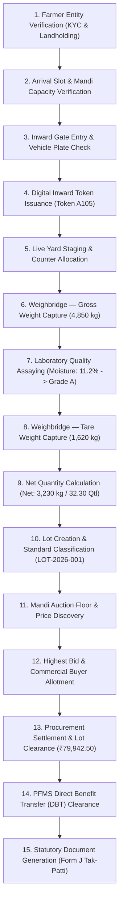

# Comprehensive Implementation Plan: APMC Mandi Procurement Management Platform

**Platform Title**: Krishi-Setu APMC — Intelligent Agricultural Procurement & Queue Management System  
**System Type**: Enterprise Staff, Operator & Mandi Administration Platform (Internal APMC ERP)  
**Standard**: SIH Problem Statement 26032 • DoCA / Ministry of Consumer Affairs, Food & Public Distribution  
**Document**: Architecture, Phased Roadmap & Specification (`docs/implementation.md`)  
**Design Reference**: Tailux React + Tailwind Admin Theme (`Sideblock` Layout)  
**Strict Scope Rule**: **100% Frontend Only**. Zero backend server, zero real database, zero external APIs.

---

## 1. Project Objective & Product Boundary

### Dual-Product Separation Architecture
The wider ecosystem consists of two strictly segregated frontend applications:
1. **The Farmer Mobile/Web App** *(Independent application)*: Dedicated to farmers for remote slot discovery, mobile token viewing, SMS alert tracking, and personal receipts.
2. **The APMC Mandi Procurement Management Platform** *(THIS APPLICATION)*: An enterprise-grade, high-density operations and queue management platform engineered specifically for **APMC Mandi Staff, Gate Guards, Weighbridge Operators, Laboratory Assayers, Auction Officers, Procurement Officers, Accounts Officers, and Mandi Supervisors/Admins**.

### Core Objective of This Platform
To digitize, automate, and streamline all ground operations within physical APMC market yards:
- **Gate Inward Security**: Fast vehicle lookup, token issuance, physical entry authorization, and traffic choke prevention.
- **Queue & Staging Operations**: Counter call consoles, physical bay allocation, vehicle call/skip/recall.
- **Electronic Scale Weighment**: Dual-phase gross and tare capture, real-time formula calculation ($Net = Gross - Tare$), calibration monitoring, and Avery certified weighment slips.
- **Laboratory Quality Assaying**: Automated moisture and foreign matter evaluation against government Fair Average Quality (FAQ) norms with Grade A/B/C certification.
- **Mandi Auction Floor**: Dynamic price discovery, live lot bidding console with MSP floor enforcement, buyer allotment, and auction audit trails.
- **Procurement Lot Clearance**: Lot ledger, commodity quota tracking, acceptance authorization, and statutory Form J Mandi Tak-Patti generation.
- **PFMS Direct Benefit Transfer (DBT)**: Batch payment clearance, bank verification, automated UTR assignment, and credit voucher printing.
- **Administrative Farmer Directory**: Full administrative directory to search, inspect, and audit farmer KYC profiles, landholdings, cumulative procurement history, and payment ledgers.

> [!IMPORTANT]
> **Farmer Role Excluded**: There is **NO Farmer Login**, **NO Farmer Dashboard**, and **NO Farmer User Role** in this application. Farmers are a **Core Business Entity** inspected and managed by APMC functionaries across all procurement stages.

---

## 2. Frontend-Only Architecture

The system operates strictly as a **Client-Side Reactive Single Page Application (SPA)**:

```
┌─────────────────────────────────────────────────────────────────────────────┐
│                             BROWSER RUNTIME (SPA)                           │
│                                                                             │
│  ┌─────────────────────────┐  ┌──────────────────────────────────────────┐  │
│  │   React 19 + Vite 8     │  │   React Router v7 (Nested Route Tree)    │  │
│  └─────────────────────────┘  └──────────────────────────────────────────┘  │
│                                                                             │
│  ┌───────────────────────────────────────────────────────────────────────┐  │
│  │       ProcurementContext (Centralized Reactive State Engine)          │  │
│  │   • In-Memory Relational State  • LocalStorage Persistence            │  │
│  │   • 7 Operational APMC Roles    • Event/Action Dispatchers            │  │
│  │   • Queue Progress Simulator    • 1-Click Demo State Reset            │  │
│  └───────────────────────────────────┬───────────────────────────────────┘  │
│                                      │                                      │
│               ┌──────────────────────┴──────────────────────┐               │
│               ▼                                             ▼               │
│  ┌───────────────────────────┐               ┌───────────────────────────┐  │
│  │ Relational Mock Datasets  │               │   UI Presentation Layer   │  │
│  │ • 52 Farmer Entity Recs   │               │ • Sideblock Shell Layout  │  │
│  │ • 5 APMC Mandi Centers    │               │ • 7 Staff Role Dashboards │  │
│  │ • 8 MSP Crops & Standards │               │ • TanStack-Style Tables   │  │
│  │ • 38 Inward Queue Tokens  │               │ • Slide-Over Drawers      │  │
│  │ • 105 Procurement Lots    │               │ • Recharts Visualizations │  │
│  │ • 12 Active Auctions      │               │ • @media print Slips      │  │
│  │ • 56 PFMS DBT Vouchers    │               │ • Toast Feedback Alerts   │  │
│  └───────────────────────────┘               └───────────────────────────┘  │
└─────────────────────────────────────────────────────────────────────────────┘
```

### Core Architecture Principles:
1. **Single Source of Truth**: All operational records (Farmers, Slots, Tokens, Gate Inward, Weighments, Quality Assays, Lots, Auctions, DBT Vouchers) reside in a coherent reactive context (`ProcurementContext`).
2. **Local Persistence**: State changes automatically sync with `localStorage` (prefixed by `krishi_setu_`), ensuring page reloads retain ongoing operational simulations.
3. **Simulated Delays & Transitions**: Critical operations (Weighbridge Tare recording, Assay lab approval, Auction bid placement, DBT batch settlement) execute with realistic micro-delays (400–800ms) and dispatch instant toast notifications.
4. **Strict Boundary**: Absolutely NO external network calls, NO Express/NestJS backend, NO PostgreSQL/MongoDB, NO Firebase, NO live payment gateways.

---

## 3. Theme Integration Strategy

The design language strictly adheres to the provided **Tailux React + Tailwind Admin Theme** (`Sideblock` layout):
- **Layout Foundation**: Single fixed/collapsible sidebar (`w-64`), sticky blurred topbar with center picker, notification drawer trigger, and role switcher.
- **Color Tokens**:
  - **Primary**: Emerald Green (`#059669` / `#10b981`) — Government authority, verified KYC, passed quality, completed DBT.
  - **Secondary Accent**: Golden Harvest Amber (`#f59e0b` / `#d97706`) — Grain commodity, active queues, pending assays, live bidding.
  - **Status Accents**: Sky Blue (In Progress/Staging), Rose Red (Rejected/Delayed), Slate (Queued/Neutral).
- **Surfaces & Cards**: `bordered` skin with `border border-slate-200 bg-white rounded-xl shadow-xs`, ensuring high legibility in outdoor mandi office environments.
- **Micro Typography**: High-density scales (`text-tiny` = 11px, `text-xs` = 12px, `text-sm` = 14px, `text-base` = 16px) with Inter font pairing.
- **Print Optimization**: `@media print` rules that suppress all sidebars, headers, action buttons, and backdrops to produce pixel-perfect official government documents.

---

## 4. User Roles (7 Operational APMC Staff Roles)

The platform features **7 dedicated operational roles** accessible via the Login screen or the persistent topbar Role Switcher:

| Role ID | Role Title | Primary Functional Focus |
|---|---|---|
| `gate_operator` | **Gate / Entry Operator** | Vehicle verification, security inward pass, queue slot validation, on-the-spot token generation |
| `weighbridge_operator` | **Weighbridge Operator** | Scale calibration, gross weight capture, tare weight capture, net calculation ($Net = Gross - Tare$) |
| `quality_assayer` | **Quality / Assay Officer** | Moisture test bench, foreign matter analysis, shriveled grain %, Grade A/B/C certification |
| `auction_officer` | **Auction / Mandi Officer** | Lot price discovery, bidding clock, MSP floor price validation, buyer allotment, auction ledger |
| `procurement_officer` | **Procurement Officer** | Lot clearance approval, commodity quota tracking, rejection review, cross-center MSP oversight |
| `accounts_officer` | **Payment / Accounts Officer** | PFMS DBT batch clearance, bank account verification, UTR generation, payment voucher issuance |
| `admin` | **Mandi Supervisor / Admin** | Complete operational KPIs, center capacity config, counter allocation, dispute redressal, multi-center analytics |

---

## 5. Role-Based Dashboards (7 Operational Views)

Each operational role has a dedicated dashboard surface displaying role-specific KPIs, priority operational consoles, quick actions, and tailored data tables:

### A. Gate / Entry Operator Dashboard (`/dashboard/gate`)
- **KPI Metrics**: Today's Inward Arrivals (84 Vehicles), Waiting at Inward Gate (12), Tokens Issued Today (96), Peak Inward Hour (10:00 AM).
- **Fast Inward Check-in Form**: Vehicle registration number lookup, driver phone verification, appointment verification, 1-click token issue.
- **Live Gate Inward Ledger**: Real-time table of recent vehicle arrivals with farmer name, commodity, vehicle type, and Inward Gate Pass printing action.
- **Quick Actions**: Generate On-Spot Token, Emergency Gate Hold, Print Inward Gate Pass.

### B. Weighbridge Operator Dashboard (`/dashboard/weighbridge`)
- **KPI Metrics**: Total Gross Weighed (Qtl), Tare Pending (Vehicles in Yard), Average Scale Turnaround (3.2 min), Calibrated Scale Status (Avery WB-01 & WB-02 Active).
- **Interactive Scale Console**: Real-time gross/tare entry form with automatic mathematical calculation:
  $$\text{Net Weight} = \text{Gross Weight} - \text{Tare Weight}$$
  $$\text{Net Quintals} = \frac{\text{Net Weight (kg)}}{100}$$
- **Scale Weighment Queue**: Dual-tab table separating *First Weighment (Gross)* and *Second Weighment (Tare)*.
- **Quick Action**: 1-Click Print Avery Certified Weighment Certificate.

### C. Quality / Assay Officer Dashboard (`/dashboard/quality`)
- **KPI Metrics**: Samples Tested Today (64), Passed FAQ (61), Grade A Ratio (78%), Rejection Rate (1.4%).
- **Digital Laboratory Test Bench**: Form with automatic grading algorithm based on government MSP standards:
  - Moisture % ($\le 12.0\%$ standard for Wheat)
  - Foreign Matter % ($\le 1.5\%$)
  - Shriveled / Immature Grains % ($\le 3.0\%$)
  - Auto Grade Assignment: **Grade A** / **Grade B** / **Rejected**
- **Pending Assay Queue**: List of inward vehicle lots awaiting laboratory sampling, with farmer identification and commodity code.
- **Quick Action**: Issue Digital Quality Assay Certificate.

### D. Auction / Mandi Officer Dashboard (`/dashboard/auction`)
- **KPI Metrics**: Active Lots in Auction (12), Total Auction Value Today (₹1.24 Cr), Highest Realized Premium (+8.5% over MSP), Participating Buyers (42 Registered Traders).
- **Live Bidding Console**: Real-time bidding interface showing lot details, farmer name, MSP reference floor rate, highest current bid, top bidder company, and interactive bid increment buttons (+₹25, +₹50, +₹100).
- **Completed Auctions Table**: Ledger of assigned commercial buyers, winning bid amounts, and lot clearance authorizations.
- **Quick Action**: Place Live Bid, Close Auction & Allot Lot.

### E. Procurement Officer Dashboard (`/dashboard/procurement`)
- **KPI Metrics**: Total Inward Volume (Qtl), Total Approved Procurement Value (₹), Average Procurement Price, Center Quota Utilization (84%).
- **Commodity Volume Breakdown**: Recharts visualization of commodity-wise receipts.
- **Lot Approvals Ledger**: High-density table of lots pending clearance, with farmer details and slide-over drawer inspection.
- **Quick Action**: Batch Approve Lots, Issue Mandi Tak-Patti (Form J).

### F. Payment / Accounts Officer Dashboard (`/dashboard/accounts`)
- **KPI Metrics**: Total Settled DBT (₹77.8 L), Pending Disbursement (₹14.8 L), Total Vouchers Generated (68), Average Settlement Time (18 hrs).
- **Batch DBT Disbursement Console**: Multi-select table of approved lots with bulk payment trigger, farmer bank account display, and confirmation modal.
- **PFMS Settlement Ledger**: Comprehensive ledger with simulated Bank Name, Masked Account, IFSC, and generated UTR reference numbers.
- **Quick Action**: Batch Disburse DBT, Print PFMS Payment Voucher.

### G. Mandi Supervisor / Admin Dashboard (`/dashboard/admin`)
- **Flagship Management Overview**: Complete APMC hub health with 8 high-level KPI cards.
- **Cross-Counter Operational Consoles**: Live status of Counters 1–6 (Serving token, current operator, served count, avg processing speed).
- **Analytical Charts**: 7-day procurement volume trajectory and commodity distribution pie chart.
- **Recent Mandi Activity Log**: Live audit feed of gate check-ins, assay approvals, auctions, and DBT clearances.

---

## 6. Login Flow & Experience (7 Staff Roles)

A dedicated, enterprise-grade Login Screen at `/login`:
- **Branding**: Official Government of Maharashtra APMC & DoCA emblem with "Krishi-Setu APMC Staff & Operator Portal" identity.
- **Interactive "Login As" Role Matrix**: **7 selectable operational roles**:
  - `[ Gate / Entry Operator ]`
  - `[ Weighbridge Operator ]`
  - `[ Quality / Assay Officer ]`
  - `[ Auction / Mandi Officer ]`
  - `[ Procurement Officer ]`
  - `[ Payment / Accounts Officer ]`
  - `[ Mandi Supervisor / Admin ]`
- **Demo Quick-Fill Credentials**: Pre-configured demo staff accounts (e.g. `gate.operator@apmc.gov.in`, `weighbridge@apmc.gov.in`, `admin@krishisetu.gov.in`).
- **Remember Me & Language Selector**: English, Hindi, and Marathi toggle.
- **Instant Redirection**: On clicking "Sign In to APMC Console", the selected role is stored in `localStorage` and the user is routed directly to their corresponding role dashboard.

---

## 7. Application Routes Architecture

```
/                                   -> Redirect to /dashboard or /login based on session
/login                              -> Role Selection & Demo Login Screen (7 APMC Roles)
/dashboard                          -> Role-aware dashboard dispatcher (routes to active staff dashboard)
/dashboard/admin                    -> Mandi Supervisor / Admin Dashboard
/dashboard/gate                     -> Gate / Entry Operator Dashboard
/dashboard/weighbridge              -> Weighbridge Scale Station Dashboard
/dashboard/quality                  -> Quality Assay Lab Dashboard
/dashboard/auction                  -> Auction & Bidding Dashboard
/dashboard/procurement              -> Procurement Officer Dashboard
/dashboard/accounts                 -> Payment & Accounts Dashboard

/procurement/overview               -> High-level Procurement Analytics & Centers
/procurement/centers                -> APMC Mandi Discovery & Yard Capacity
/procurement/schedules              -> Farmer Arrival Schedule & Slot Capacity Manager
/procurement/tokens                 -> Inward Token Queue & Yard Wait-Time Radar
/procurement/queue                  -> Operator Counter Console (Call/Skip/Recall)
/procurement/gate-entry             -> Gate Inward Kiosk & Vehicle Log
/procurement/weighbridge            -> Electronic Weighbridge Station & Scale Log
/procurement/quality                -> Laboratory Quality Test Bench & Standards
/procurement/lots                   -> Master Procurement Lots Ledger
/procurement/auctions               -> Live Mandi Auction & Bidding Floor

/farmers                            -> Farmer Master Directory (52 Profiles)
/farmers/:id                        -> Administrative Farmer Profile, Landholding & Audit History

/payments/overview                  -> Financial Summary & DBT Engine Status
/payments/pending                   -> Pending DBT Disbursement & Bulk Clearance
/payments/history                   -> Settled Transactions Ledger with UTRs

/documents                          -> Central Document Printing Hub
/documents/tak-patti                -> Mandi Tak-Patti (Form J) Slip
/documents/weighment-slips          -> Avery Certified Scale Receipts
/documents/procurement-receipts     -> Official Procurement Acceptance Slips
/documents/payment-vouchers         -> PFMS DBT Payment Vouchers
/documents/gate-passes              -> Security Inward Gate Passes

/reports                            -> Analytics & Performance Reporting
/reports/procurement                -> Commodity & Volume Trajectory Reports
/reports/centers                    -> Cross-Center Performance Benchmarking

/communication/notifications        -> Real-time Notification Alert Center
/communication/feedback             -> Farmer Grievance & Dispute Redressal

/settings                           -> Master System Configuration
/settings/centers                   -> APMC Mandi & Counter Configuration
/settings/crops                     -> MSP Master Rates & Quality Limits
/settings/preferences               -> Platform Units, Polling, & Demo Reset

/*                                  -> Fallback redirect to /dashboard
```

---

## 8. Page Structure & Layout System

The platform uses a unified, responsive **Sideblock Shell**:
- **Sidebar (`Sidebar.jsx`)**:
  - Top: Krishi-Setu APMC Staff Portal logo and authority badge.
  - Navigation Sections:
    - **Dashboard**: Role-targeted main dashboard.
    - **Procurement Operations**: Gate Entry, Tokens, Queue Management, Weighbridge, Quality Assay, Procurement Lots, Auctions.
    - **Farmer Records**: Administrative Farmer Directory, KYC Inspection, Procurement Audit Trail.
    - **Payments & Accounts**: DBT Overview, Pending Disbursements, Payment History.
    - **Documents**: Mandi Tak-Patti (Form J), Weighment Slips, Gate Passes, Payment Vouchers.
    - **Reports & Analytics**: Volume Trajectory, Center Performance.
    - **Communication**: Alerts, Grievance Redressal.
    - **Settings**: Center & Counter Config, MSP Master Rates.
  - Bottom: Live APMC Operational Status indicator ("Govt Procurement Window Active • MSP Rabi 2026").
- **Header (`Header.jsx`)**:
  - Left: Mobile hamburger trigger, Center selector dropdown (Pune, Baramati, Nashik, Sangli, Latur).
  - Center: Global Search trigger with keyboard shortcut hint (`Ctrl + K`).
  - Right: Notification popover with unread counter, persistent 7-Role Switcher trigger, and active staff profile.
- **Top Demo Journey Banner (`DemoJourneyBanner.jsx`)**:
  - Sticky interactive pipeline linking all 9 key steps of farmer Ramesh Patil's lot journey for evaluator inspection.
- **Main Canvas (`AppLayout.jsx`)**:
  - Max-width `max-w-7xl`, smooth custom emerald scrollbars, responsive padding.

---

## 9. Reusable Component Inventory

| Category | Component | Key Capabilities |
|---|---|---|
| **Layout** | `AppLayout` | Sideblock container, responsive drawer toggle, outlet wrapper |
| **Layout** | `Sidebar` | Collapsible navigation modules, active route pill, mobile backdrop |
| **Layout** | `Header` | APMC center switcher, role badge, quick search |
| **Layout** | `RoleSwitcher` | Interactive role changer supporting the 7 staff roles |
| **Common** | `MetricCard` | Title, numerical value, sublabel, icon, trend indicator |
| **Common** | `StatusBadge` | Semantic status pills (15+ states) with animated live dots |
| **Common** | `DataTable` | Free-text search, column sorting, status/commodity filtering, pagination, selection |
| **Common** | `DetailDrawer` | Slide-over inspector panel with backdrop and comprehensive data tabs |
| **Common** | `ConfirmationModal`| Action confirmation dialog (Call Next, Reject Lot, Disburse DBT) |
| **Common** | `Timeline` | 9-stage procurement lifecycle horizontal/vertical progress tracker |
| **Common** | `EmptyState` | Consistent empty data illustration and call to action |
| **Common** | `LoadingState` | Skeleton shimmer placeholder for table and card loading |
| **Common** | `DemoJourneyBanner`| Interactive 9-stage demo walkthrough navigation bar |
| **Documents** | `TakPattiPrint` | Official Form J Mandi Tak-Patti slip with market committee seal |
| **Documents** | `WeighmentSlipPrint`| Avery certified gross-to-tare scale certificate |
| **Documents** | `GatePassPrint` | Security inward pass with barcoded token header |
| **Documents** | `PaymentVoucherPrint`| Government PFMS DBT credit certificate with UTR reference |

---

## 10. Mock Data Architecture (Farmer as Core Entity)

A coherent, interconnected relational dataset centered around flagship farmer **Ramesh Patil**:

```
mockFarmers.js (52 Farmer Entity Profiles)
    │ Farmer ID: F-1001 (Ramesh Balasaheb Patil)
    │ Landholding: 8.5 Acres • Village: Haveli • Bank: SBI ••••••••5412
    ▼
mockTokens.js (38 Inward Tokens)
    │ Token: A105 • Farmer: Ramesh Patil (F-1001) • Commodity: Wheat (Sharbati)
    │ Vehicle: MH-12-AQ-4481 • Gate: Gate 2 North
    ▼
mockCenters.js (5 APMC Mandis)
    │ Center: C-01 (Pune APMC Yard, Market Yard, Gultekdi)
    ▼
mockLots.js (105 Lots)
    │ Lot ID: LOT-2026-001 • Farmer: Ramesh Patil (F-1001)
    │ Gross: 4,850 kg • Tare: 1,620 kg • Net: 3,230 kg (32.30 Qtl)
    │ Moisture: 11.2% • Grade: Grade A Passed
    │ Financials: 32.30 Qtl × ₹2,475/Qtl MSP = ₹79,942.50
    ▼
mockAuctions.js (12 Active / Cleared Auctions)
    │ Lot: LOT-2026-001 • Farmer: Ramesh Patil • Base MSP: ₹2,475
    │ Winning Bid: ₹2,510/Qtl • Buyer: Mahagrains Commercial Trading Ltd.
    ▼
mockPayments.js (56 DBT Vouchers)
    │ Payment Ref: PFMS-2026-MH-8921034 • Beneficiary: Ramesh Patil
    │ Bank: State Bank of India • Account: ••••••••5412 • Status: PAID • UTR Generated
```

---

## 11. Complete Procurement Lifecycle (15 Stages)

The platform models the complete 15-stage agricultural procurement lifecycle:



---

## 12. Dashboard Modules & Feature Requirements

1. **Gate Operations**: Inward scanning, physical gate assignment, vehicle number verification, driver mobile check, on-the-spot token printing.
2. **Token & Queue Radar**: Live counter radar showing serving token, next tokens, wait-time breakdown ($Wait = \frac{Position \times ServiceTime}{Counters}$), SMS dispatch simulator.
3. **Electronic Weighbridge Station**: Dual-phase gross/tare capture with animated scale visualizer, zero tolerance drift monitoring ($\pm 5\text{ kg}$), Avery scale certificate generation.
4. **Quality Testing Lab**: Moisture probe testing, foreign matter percentage, grade classification (Grade A / Grade B / Rejected), lab technician signoff.
5. **Auction & Bidding Floor**: Real-time lot bidding interface with MSP floor rate enforcement, active buyer bids, clock timer, and allotment certification.
6. **Lot Management**: Comprehensive lot ledger with TanStack-style filtering, batch multi-select, slide-over detail drawer, and status transitions.
7. **Direct Benefit Transfer (DBT)**: Bulk payment selection, total disbursement calculation modal, simulated bank gateway with auto-generated UTR numbers.
8. **Farmer Master Records**: Administrative directory to search and audit 52 farmers, view their landholding, linked bank status, active lots, and cumulative earnings.
9. **Document Center**: Multi-tab government slip printer formatted to official standards.

---

## 13. Data Tables Specification

All data tables (`DataTable.jsx`) follow the theme's dense administrative presentation:
- **Search**: Instant client-side filtering across farmer names, token IDs, lot numbers, vehicle plates, and mobile numbers.
- **Filters**: Multi-select pills for Commodity (Wheat, Soybean, Chana, Rice, Maize) and Status (Booked, Arrived, Testing, Weighed, Accepted, Paid).
- **Sorting**: Clickable column headers with visual ascending/descending arrows.
- **Pagination**: Configurable rows per page (10, 25, 50) with pagination controls and record count indicators.
- **Row Actions**: Contextual buttons for View Details (Drawer), Quick Status Advance, and Slip Printing.
- **Bulk Selection**: Top selection checkbox with sticky floating bulk-action toolbar (e.g. "4 Lots Selected • [Batch DBT Disburse ₹3,12,000]").

---

## 14. Forms Specification

All input forms use clean, high-contrast Tailwind styling with standard feedback states:
- **Gate Inward Form**: Quick vehicle number search, driver mobile validation, slot confirmation, gate assignment.
- **Weighbridge Form**: Numeric inputs with large digital font display, gross weight capture, tare weight capture, auto-calculated net weight.
- **Quality Assay Form**: Moisture % meter with color range indicators ($< 12\%$ green, $12-14\%$ amber, $> 14\%$ red), foreign matter %, shriveled grains %, grade selector.
- **Auction Bid Form**: Numeric bid input with pre-set increment buttons (+₹25, +₹50, +₹100), buyer selection.
- **Grievance Form**: Category selector (Waiting Time, Weighment Dispute, Moisture Dispute, Payment Delay), comments textarea.

---

## 15. Charts & Visualizations

Using **Recharts** styled with Tailux color tokens:
1. **Procurement Trend Trajectory**: Area/Line chart showing daily procurement volume (Quintals) over the past 7 days.
2. **Commodity Distribution**: Donut/Pie chart depicting commodity share (Wheat 48%, Soybean 28%, Chana 16%, Other 8%).
3. **Center Performance Comparison**: Grouped bar chart comparing capacity utilization across the 5 APMC centers.
4. **Payment Settlement Velocity**: Bar chart illustrating same-day vs next-day DBT clearance volumes.

---

## 16. Drawers & Modals

1. **Slide-Over Detail Drawer (`DetailDrawer.jsx`)**:
   - Right slide-over panel (`w-full max-w-xl`) with smooth slide animation.
   - Used for inspecting Lot records, Farmer KYC records, and Auction allotments without navigating away from tables.
2. **Action Modals (`ConfirmationModal.jsx`)**:
   - Centered backdrop dialog with icon header, confirmation summary, and destructive/affirmative action buttons.
   - Used for Call Next Token, Lot Rejection, Bulk DBT Payment approval, and Demo Data Reset.

---

## 17. Notifications & Alerts System

- **Category-Filtered Alerts**: Categorized under *Action Required* (Token called), *Success* (DBT paid), *Warning* (High moisture detected), and *Info* (Slot reminder).
- **Unread Counter**: Dynamic badge in the topbar header with a quick popover preview.
- **SMS Dispatch Simulator**: Visual display showing exact SMS alerts sent to the farmer's mobile at each stage of the lifecycle.
- **Mark as Read & Clear All**: 1-click controls to manage notification clutter.

---

## 18. Reports & Analytics

- **Procurement Ledger Report**: Summary of inward tonnage, accepted lots, rejected volume, and total payout value.
- **Commodity MSP Benchmarking**: Comparison of mandi procurement rates against government MSP minimums.
- **Center Efficiency Audit**: Average turnaround time per vehicle from gate inward to weighbridge gate-out.
- **Export UI**: Visual export buttons for CSV, Excel, and PDF formats.

---

## 19. Print-Ready Documents (`@media print`)

Four dedicated printable document components:
1. **Form J (Mandi Tak-Patti)**: Statutory market committee receipt with farmer details, crop variety, net weight, rate, statutory market fee deduction (1.5%), handling charges, and net payable amount.
2. **Certified Weighment Certificate**: Avery Weigh-Tronix certified weighment ticket showing Scale ID, calibration certificate date, gross weight, tare weight, net weight in kg and quintals, and weighman signature line.
3. **Inward Gate Pass**: Barcoded vehicle entry authorization slip showing token number, arrival time, vehicle plate, and bay assignment.
4. **PFMS DBT Payment Voucher**: Public Financial Management System credit voucher showing beneficiary name, masked bank account, IFSC code, transaction amount, and generated UTR reference.

---

## 20. Responsive & Mobile Behavior

- **Desktop (1920×1080 / 1440×900)**: Full 4-column metric grids, expanded sidebar, wide data tables, split-screen consoles.
- **Laptop (1366×768)**: 3-column metric grids, compact table padding, drawer-based inspection.
- **Tablet (768×1024 / iPad)**: 2-column metric cards, collapsible sidebar with off-canvas drawer, horizontally scrollable data tables.
- **Mobile (375×812 / Smartphone)**: Single-column stacked cards, touch-friendly buttons (minimum 44px tap target), full-screen modal overlays.

---

## 21. Form Validation & Error Handling

- Client-side controlled validation on all forms:
  - Phone numbers: Exactly 10 digits starting with 6–9.
  - Weights: Gross weight must strictly exceed tare weight; positive values only.
  - Moisture %: Warns if $> 12.0\%$; flags automatic rejection if $> 15.0\%$.
  - Bid Amounts: Must be greater than or equal to commodity MSP floor price.
- Inline visual error hints below fields with red border highlighting.

---

## 22. Accessibility (a11y)

- WCAG 2.1 AA compliant color contrast: Deep slate (`#0F172A`) on white (`#FFFFFF`) with high-contrast emerald and amber accents.
- Semantic HTML tags (`<nav>`, `<main>`, `<header>`, `<aside>`, `<section>`, `<article>`).
- Visible focus rings on all interactive elements (`focus:ring-2 focus:ring-emerald-500`).
- Screen-reader friendly aria labels on icon-only buttons and modal close triggers.

---

## 23. Testing & Verification

- **Automated Compilation**: Regular `npm run build` checks ensuring zero syntax, import, or bundle errors.
- **State Integrity Testing**: Verifying that calling `checkInGate`, `recordQuality`, `recordWeighment`, `placeBid`, and `processBulkPayment` correctly updates all linked mock tables in memory.
- **Print Layout Verification**: Verifying that `window.print()` triggers cleanly across all 4 document templates without visual clipping.

---

## 24. Build & Bundle Optimization

- **Build Engine**: Vite 8 with `@tailwindcss/vite` plugin.
- **Code Splitting**: Dynamic component imports for heavy modules (Charts, Documents).
- **Clean Asset Output**: Outputting clean, minified production assets in `dist/` with gzip compression.

---

## 25. Future Backend Integration Boundary

The codebase maintains a clean architectural boundary so that when a real backend is eventually implemented, zero UI rewriting will be necessary:
- **Mock Store Abstraction**: All state reading and mutating operations are routed through `ProcurementContext` helper functions (e.g. `recordWeighment`, `processSinglePayment`).
- **Seamless Service Swap**: To connect a real backend in the future, developers only need to replace the local state dispatchers with API client calls (e.g. `api.post('/procurement/weighment', data)`), leaving the UI components completely intact.

---

## Phased Implementation Roadmap (20 Phases)

### Phase 1: Project Audit & Theme Alignment
- **Objective**: Verify existing components, Tailwind configuration, and folder structure. Ensure all design tokens conform to Tailux Sideblock style.
- **Acceptance Criteria**: `npm run build` exits with code 0; color tokens and typography match theme reference.

### Phase 2: Application Shell, Sidebar & Topbar
- **Objective**: Establish the unified Sideblock layout, sticky topbar with APMC center picker, and notification popover.
- **Acceptance Criteria**: Collapsible sidebar navigation functions smoothly across desktop and mobile with staff-oriented navigation.

### Phase 3: Login & Role Selection Experience (7 APMC Roles)
- **Objective**: Build `/login` screen with the 7 selectable operational demo roles, remember me, and quick-fill credentials.
- **Acceptance Criteria**: Selecting a role and clicking login redirects to the corresponding role dashboard and persists role in `localStorage`.

### Phase 4: Mock Data Architecture Expansion
- **Objective**: Create `mockAuctions.js` and enrich `mockLots.js`, `mockTokens.js`, and `mockFarmers.js` with comprehensive relational attributes.
- **Acceptance Criteria**: Relational links between Farmer Entity $\rightarrow$ Token $\rightarrow$ Lot $\rightarrow$ Auction $\rightarrow$ Payment are complete and consistent.

### Phase 5: Mandi Supervisor / Admin Dashboard
- **Objective**: Deliver the flagship `/dashboard/admin` view with 8 KPI cards, counter consoles, Recharts volume trajectory, and activity feed.
- **Acceptance Criteria**: All statistics render dynamically from context state.

### Phase 6: Gate / Entry Operator Dashboard
- **Objective**: Deliver `/dashboard/gate` with vehicle arrival lookup, quick check-in form, and gate pass generator.
- **Acceptance Criteria**: Submitting an inward check-in generates a new token and advances the gate ledger.

### Phase 7: Weighbridge Operator Dashboard
- **Objective**: Deliver `/dashboard/weighbridge` with digital scale console, gross/tare forms, and automatic net calculation.
- **Acceptance Criteria**: Entering tare weight calculates net quintals and moves lot to cleared status.

### Phase 8: Quality / Assay Officer Dashboard
- **Objective**: Deliver `/dashboard/quality` with digital lab test bench, moisture % meter, and auto grade assignment.
- **Acceptance Criteria**: Submitting test parameters certifies lot as Grade A, B, or Rejected.

### Phase 9: Auction / Mandi Officer Dashboard
- **Objective**: Build `/dashboard/auction` and `/procurement/auctions` with live bidding interface, MSP floor enforcement, and buyer allotment.
- **Acceptance Criteria**: Clicking bid increments updates highest bid and top bidder dynamically in state.

### Phase 10: Procurement Officer Dashboard
- **Objective**: Deliver `/dashboard/procurement` with commodity volume charts, lot clearance ledger, and approval triggers.
- **Acceptance Criteria**: Approving a lot queues it for DBT payment.

### Phase 11: Payment / Accounts Officer Dashboard
- **Objective**: Deliver `/dashboard/accounts` and `/payments/pending` with batch DBT disbursement console and UTR generation.
- **Acceptance Criteria**: Multi-selecting lots and executing batch payment moves them to Paid status with unique UTRs.

### Phase 12: Administrative Farmer Directory & Profile Inspection
- **Objective**: Deliver `/farmers` and slide-over farmer drawer with comprehensive KYC profiles, landholding, cumulative earnings, and procurement history for authorized staff.
- **Acceptance Criteria**: Staff can search, inspect, and verify any of the 52 farmers without a farmer-facing portal.

### Phase 13: Procurement Lifecycle State Machine Integration
- **Objective**: Connect all 15 lifecycle transitions in `ProcurementContext` so actions in one role immediately reflect across other roles.
- **Acceptance Criteria**: Advancing a token at gate appears in weighbridge queue, assay lab, and lot ledger.

### Phase 14: Data Tables, Slide-Over Drawers & Filters
- **Objective**: Ensure all master tables feature multi-column search, status filters, pagination, and slide-over inspection drawers.
- **Acceptance Criteria**: Clicking any table row opens `DetailDrawer` with complete audit details.

### Phase 15: Statutory Documents & Print Layouts
- **Objective**: Finalize `@media print` layouts for Form J Tak-Patti, Weighment Slip, Gate Pass, and Payment Voucher.
- **Acceptance Criteria**: Printing from browser produces authentic, clean government slips with zero layout clipping.

### Phase 16: Reports & Analytics Module
- **Objective**: Deliver `/reports/procurement` and `/reports/centers` with trajectory charts, MSP benchmarking, and CSV export UI.
- **Acceptance Criteria**: Charts render responsively with interactive tooltips.

### Phase 17: Responsive & Mobile Optimization
- **Objective**: Test and refine layout across Desktop, Laptop, Tablet, and Mobile viewports.
- **Acceptance Criteria**: Sidebar collapses into off-canvas drawer on mobile; tables scroll horizontally without breaking container.

### Phase 18: UX Polish & Accessibility
- **Objective**: Add keyboard shortcuts (`[N]` for Next Token, `[T]` for Tare, `[P]` for Print), loading shimmers, and toast notifications.
- **Acceptance Criteria**: All forms have accessible labels and visible focus rings.

### Phase 19: Comprehensive End-to-End Testing
- **Objective**: Execute the entire 15-stage procurement journey from Inward Gate to DBT Settlement without errors.
- **Acceptance Criteria**: Flawless demonstration of Ramesh Patil's entire journey across staff desks.

### Phase 20: Production Build & Deployment Verification
- **Objective**: Run `npm run build` and `npm run preview` to verify zero bundle warnings and fast initial load.
- **Acceptance Criteria**: Build succeeds with 0 errors and production artifacts are generated in `dist/`.
